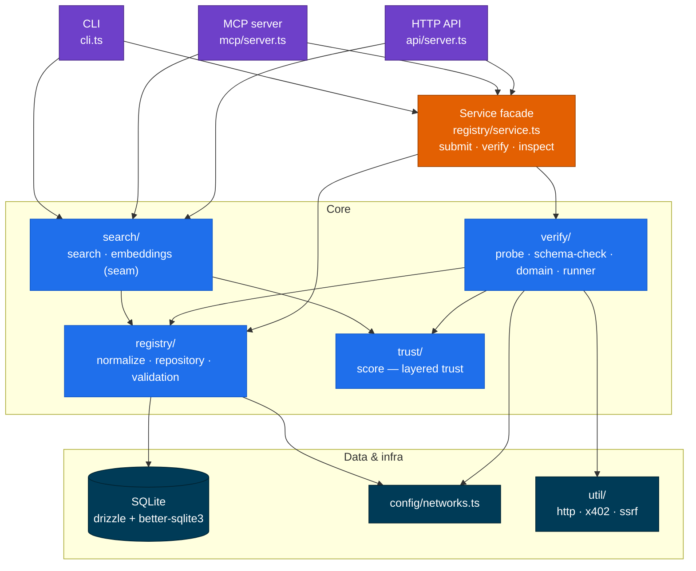

<div align="center">

# PIXA Registry

### A multichain, agent-native, **verified** discovery layer for machine-payable APIs

[](LICENSE)
[](https://nodejs.org)
[](https://www.typescriptlang.org)
[](https://hono.dev)
[](https://orm.drizzle.team)
[](https://modelcontextprotocol.io)
[](https://x402.org)
[](#status)

*Bazaar lists endpoints. PIXA Registry **proves** they work — reachable, payable, and callable by an agent.*

</div>

---

## Overview

Machine-payable (x402) APIs are hard to discover and harder to trust. Listings are
scattered, metadata is thin, and an agent rarely knows the method, the request shape,
the payment rail, or whether the endpoint even works right now.

PIXA Registry is **discovery + verification + agent usability** in one layer:

| | |
|---|---|
| **Multichain** | Not locked to one facilitator. Algorand, Base, Solana, Stellar, more. |
| **Verified, not self-declared** | Live probes confirm reachability, `402` payment gating, and schema consistency. |
| **Agent-native** | An MCP server exposes the registry as tools so agents can discover, inspect, test, and submit. |
| **Layered trust** | Operational / schema / domain / community signals — never one fake "good API" score. |
| **Wallet-aware** | Each listing knows if it's directly payable, hub-payable, or CDP-only. |
| **Honest** | We report what we can prove and defer the rest to reviews — no overclaiming. |

> This repository is the **MVP**: zero-infra (SQLite + lexical search), three surfaces
> over one core — **HTTP API**, **MCP server**, and **CLI**.

---

## Quick start

```bash
npm install
npm run seed         # create the SQLite DB + load sample listings (verifies the live ones)

npm run start:api    # HTTP API   -> http://localhost:4055
npm run mcp          # MCP server -> stdio (for agents / Claude)
npm run cli -- help  # CLI
```

`npm run seed` loads four **real, live** x402 endpoints (the deployed Pixa API on
Algorand testnet) plus two example multichain listings. The live ones verify
end-to-end and come back **`tier: verified`**.

```bash
npm run cli -- search product hunt upvotes
npm run cli -- inspect <id>
npm run cli -- verify --all
npm run cli -- networks
```

---

## Architecture

One core, three delivery surfaces, one shared SQLite database.



| Path | Responsibility |
|------|----------------|
| `src/types.ts` | Domain types (single source of truth). |
| `src/config/networks.ts` | Multichain registry + wallet-compatibility logic. |
| `src/db/` | Drizzle schema, SQLite client (idempotent `CREATE TABLE`), `init`. |
| `src/util/` | `http` (timed, SSRF-guarded fetch), `x402` (challenge parser), `ssrf`. |
| `src/registry/` | `normalize`, `repository`, `validation` (zod), `service` (facade). |
| `src/verify/` | `probe` (health / unpaid / paid), `schema-check`, `domain`, `runner`. |
| `src/trust/score.ts` | Layered trust scores -> tier + labels + ranking. |
| `src/search/` | `search` (lexical/hybrid + filters), `embeddings` (vector seam). |
| `src/api/server.ts` · `src/mcp/server.ts` · `src/cli.ts` | The three surfaces. |

---

## Surfaces

### HTTP API

| Route | Description |
|-------|-------------|
| `GET /health` | liveness |
| `GET /networks` | supported networks + payability flags |
| `GET /categories` | categories with domain validators |
| `GET /stats` | counts by status / trust tier |
| `POST /services` | submit a listing `{ resourceUrl, ... }` (validate -> normalize -> verify) |
| `GET /services` | list (filters: `network, family, scheme, testnet, mainnet, category, walletCompatibility, minTrust, includeBroken`) |
| `GET /services/:id` | full detail (record + probe history + reviews) |
| `POST /services/:id/verify` | re-run verification (`?paid=true` to attempt a paid probe) |
| `POST /services/:id/reviews` | add a community review `{ rating, comment?, author? }` |
| `GET /search` | ranked, agent-optimized result cards (`q` + filters + `limit/offset`) |

### MCP server (agent-native)

Stdio MCP server exposing five tools: `search_registry`, `inspect_service`,
`test_service`, `list_supported_networks`, `submit_service`.

```json
{
  "mcpServers": {
    "pixa-registry": { "command": "npm", "args": ["run", "mcp"], "cwd": "<abs path to this folder>" }
  }
}
```

### CLI

```
pixa init | seed | submit <url> [flags] | list | search <q> | inspect <id>
     | verify <id|--all> [--paid] | delete <id> | networks | stats | serve | mcp
```

---

## Trust model

Trust is decomposed so the registry never overclaims:

| Signal | Answers |
|--------|---------|
| **operational** | reachable, returns proper `402` gating, latency, reliability, freshness |
| **schema** | declared request/response schemas complete and self-consistent |
| **domain** | category-specific validator passed (weather / image / otp / company) — optional |
| **community** | user ratings / reviews |

These roll up to a **tier** (`verified` · `community` · `experimental` · `flaky` ·
`broken` · `unverified`) and presentation **labels** (`Payment Verified`,
`Schema Verified`, `Category Verified`, `Community Approved`, …). Search ranking
blends lexical relevance with these so verified, reliable, fresh services surface
first; broken is hidden by default.

**How verification works:** `verifyService` runs **health -> unpaid -> declared-schema
(-> optional paid)** probes, records each in `probe_runs`, recomputes the layered
scores, derives a status, and persists. The **unpaid probe** expects `402` + a valid
x402 `Payment-Required` challenge, parses the `accepts`, and compares them to the
declared metadata — flagging `chain_mismatch`, `pay_to_mismatch`, `scheme_mismatch`,
`asset_mismatch`, exactly the builder diagnostics the design calls for.

---

## Security

- **SSRF guard** (`util/ssrf.ts`): every outbound probe is `http(s)`-only and must
  resolve to a public IP — loopback, link-local, cloud-metadata (`169.254.169.254`),
  and RFC1918 ranges are blocked; redirects are followed manually and re-checked per
  hop. Set `PIXA_ALLOW_PRIVATE=1` only for local testing.
- **Body cap** during streaming (256 KB) — no buffering of huge payloads.
- **Rate limiting** on the real socket IP (set `PIXA_TRUST_PROXY=1` behind a proxy).
- **Optional write auth**: set `PIXA_ADMIN_KEY` to require `x-api-key` on mutating routes.

---

## Status

**Working:** submission -> validation -> normalization -> storage; live health + unpaid
(`402`) verification with x402 challenge parsing and chain/payTo/scheme/amount matching;
layered trust scoring, tiers, labels; lexical/hybrid search + structured filters + agent
result cards; multichain network registry + wallet compatibility; domain validators;
reviews; all three surfaces.

**Seams (designed for, not yet wired):**

- **Paid probe** — `BuyerAdapter` interface present; returns `skipped` until a wallet is registered.
- **Embeddings / vector search** — `search/embeddings.ts` is the seam; the MVP ranks lexically.
- **Optional LLM semantic checks** — fields exist; no LLM is called yet.
- **SQLite** instead of Postgres/pgvector — schema kept Postgres-portable.

---

## Configuration

| Env | Default | Notes |
|-----|---------|-------|
| `PIXA_DB` | `./data/pixa.db` | SQLite path (`:memory:` supported) |
| `PORT` | `4055` | HTTP API port |
| `RATE_LIMIT_RPM` | `120` | API rate limit per IP |
| `PIXA_ADMIN_KEY` | _(unset)_ | when set, required on write routes |
| `PIXA_TRUST_PROXY` | _(unset)_ | honor `X-Forwarded-For` behind a proxy |
| `PIXA_CORS_ORIGINS` | `*` | comma-separated CORS allowlist |
| `PIXA_ALLOW_PRIVATE` | _(unset)_ | bypass SSRF guard (local dev only) |

---

## Roadmap

Web UI + playground · real embeddings (pgvector) · live paid-probe buyer adapters ·
reputation / attestations · scheduled re-verification workers · Postgres migration.

---

## License

[GNU General Public License v3.0](LICENSE) © PIXA Registry contributors.
